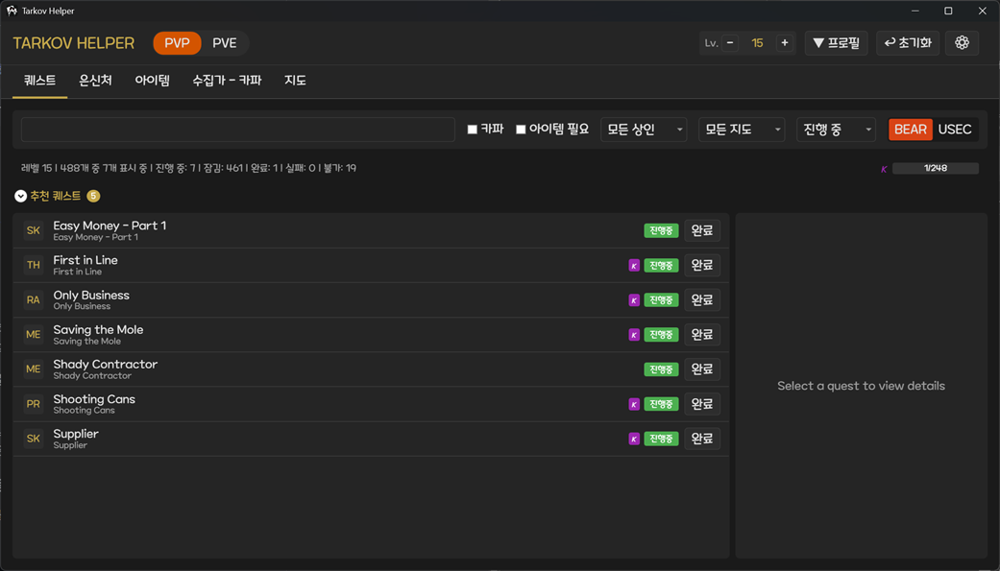
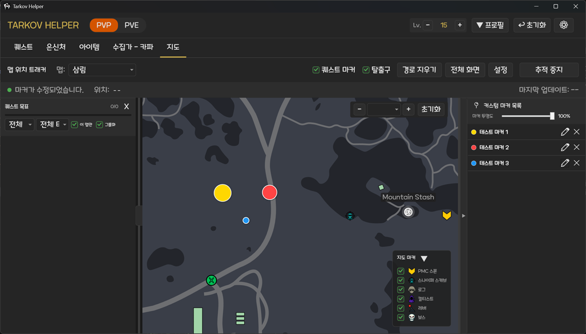
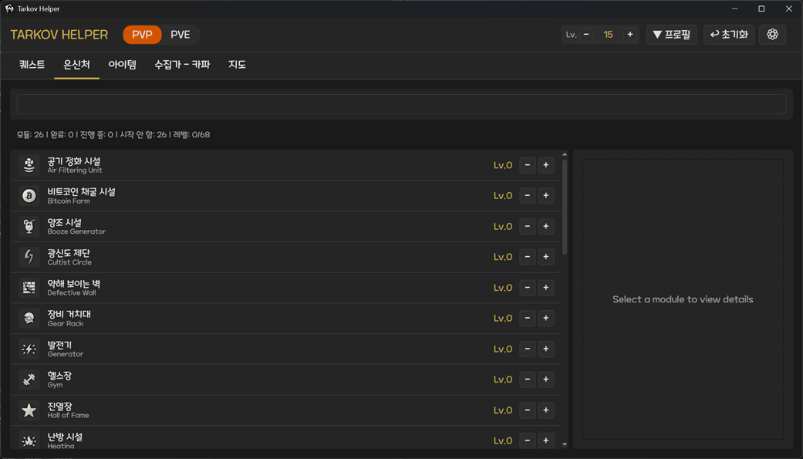

# TarkovHelper

Escape from Tarkov 퀘스트 및 은신처 진행 상황을 추적하는 Windows 데스크톱 애플리케이션입니다.

## 주요 기능

### 퀘스트 관리
- 모든 퀘스트 목록 조회 및 검색
- 퀘스트 완료/진행중 상태 추적
- 선행 퀘스트 및 후속 퀘스트 표시
- 퀘스트 시작 시 선행 퀘스트 자동 완료 처리
- 퀘스트 위키 링크 연결

### 은신처 관리
- 은신처 시설별 건설 레벨 추적
- 각 레벨 업그레이드에 필요한 아이템 표시
- 필요 트레이더, 스킬, 의존 시설 정보 제공

### 필요 아이템 추적
- 진행중인 퀘스트에 필요한 아이템 집계
- 은신처 건설에 필요한 아이템 집계
- 일반 아이템과 FIR(Found in Raid) 아이템 구분 추적
- 보유 수량 및 남은 필요 수량 계산
- 아이템 위키 링크 및 아이콘 표시

### PVE/PVP 모드 독립 관리
- PVE와 PVP 프로필 데이터의 완전한 분리 추적
- 메인 인터페이스에서 클릭 한 번으로 모드 전환
- 각 모드별 독립적인 퀘스트 진행도, 창고, 은신처 상태 관리

### 지도 및 위치 추적
- 게임 내 스크린샷(PrintScreen)을 통한 실시간 위치 추적 및 표시
- 레이드 시작 시 해당 맵으로 자동 전환 기능
- 퀘스트 목표 지점 및 상세 정보 마커 표시
- 탈출구(PMC, Scav, Transit) 위치 및 조건 표시
- 주요 마커 오버레이 (PMC 스폰, 보스, 로그, 컬티스트, 레버 등)
- 사용자 정의 커스텀 마커 추가 및 관리
- 고도(Y축) 기반 자동 층(Floor) 전환 시스템
- 게임 화면 위 오버레이 미니맵 지원

### 게임 로그 모니터링
- 게임 로그에서 퀘스트 완료 자동 감지
- BSG 런처 및 Steam 버전 모두 지원
- 게임 설치 폴더 자동 탐지

### 한국어 인터페이스 최적화
- 한국어 사용자 커뮤니티에 최적화된 인터페이스 제공
- 모든 기능의 완벽한 한글화

## 스크린샷

## 설치 방법

### 요구 사항
- Windows OS
- [.NET 8.0 Runtime](https://dotnet.microsoft.com/download/dotnet/8.0)

### 릴리즈 다운로드
[Releases](../../releases) 페이지에서 최신 버전을 다운로드하세요.

## 사용 방법

### 데이터 업데이트
앱을 처음 실행하면 [tarkov.dev](https://tarkov.dev) API에서 최신 퀘스트, 아이템, 은신처 데이터를 자동으로 가져옵니다.

수동으로 데이터를 업데이트하려면:
**설정** 탭에서 API 데이터 업데이트 **클릭**

### 퀘스트 추적
1. **퀘스트** 탭에서 퀘스트 목록 확인
2. 체크박스로 완료 상태 표시
3. 검색창으로 퀘스트 검색
4. 퀘스트 클릭 시 상세 정보 및 선행/후속 퀘스트 확인

### 은신처 추적
1. **은신처** 탭에서 시설 목록 확인
2. 각 시설의 현재 레벨 설정
3. 다음 레벨 업그레이드에 필요한 아이템 확인

### 필요 아이템 확인
1. **필요 아이템** 탭에서 전체 필요 아이템 확인
2. 보유 수량 입력으로 진행 상황 추적
3. FIR 아이템은 별도로 관리

### 게임 로그 연동
게임 설치 폴더를 자동 감지하여 퀘스트 완료 시 알림을 받을 수 있습니다.

### 지도 기능 활용
1. **지도** 탭에서 현재 플레이 중인 맵을 선택하거나, 로그 연동을 통해 자동으로 전환합니다.
2. 게임 설정에서 `PrintScreen` 키를 누르면 플레이어의 실시간 위치가 지도 위에 표시됩니다.
3. 퀘스트 목표와 탈출구 위치를 마커로 확인하세요.
4. 마우스 우클릭으로 지점 정보를 확인하고 커스텀 마커를 추가할 수 있습니다.
5. 건물의 다른 층을 보려면 `NumPad` 키나 인터페이스의 층 선택기를 사용하세요.

## 기술 스택

- **프레임워크**: .NET 8.0, WPF
- **언어**: C# 13
- **API**: [tarkov.dev GraphQL API](https://tarkov.dev)

## 데이터 저장 위치

모든 데이터는 `Data/` 폴더에 저장됩니다:
- `user_data.db` - **SQLite 데이터베이스**: PVE/PVP 통합 사용자 진행 상황(진행도, 아이템 등) 저장
- `tasks.json` - API에서 받은 퀘스트 데이터 캐시
- `items.json` - API에서 받은 아이템 데이터 캐시
- `hideouts.json` - API에서 받은 은신처 데이터 캐시
- `app_settings.json` - 앱 설정 및 사용자 환경 설정

## 라이선스

MIT License

## 크레딧

- 게임 데이터: [tarkov.dev](https://tarkov.dev)
- Escape from Tarkov는 Battlestate Games의 상표입니다.
